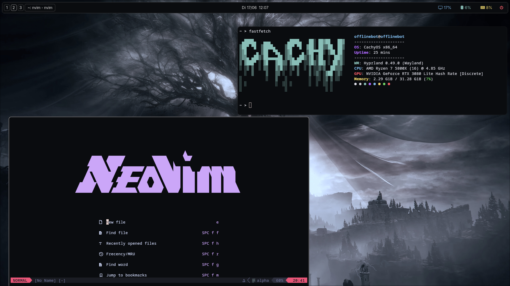

My Arch Linux Setup.

## Includes:
- Aylurs-GTK-Shell
- Hyprland + Hyprlock
- Neovim with Lazy
- rofi

## Screenshot


## Installation
Clone the oepo and get into:

```sh
git clone https://github.com/OfflineBot/arch_new.git
```

Create `~/.dotfiles` and copy the content of the repo:

```sh
cd arch_new
mkdir ~/.dotfiles
cp ./* ~/.dotfiles
```

Install the apps from the installation script:

```sh
cd ~/.dotfiles/setup
./install.sh
```

